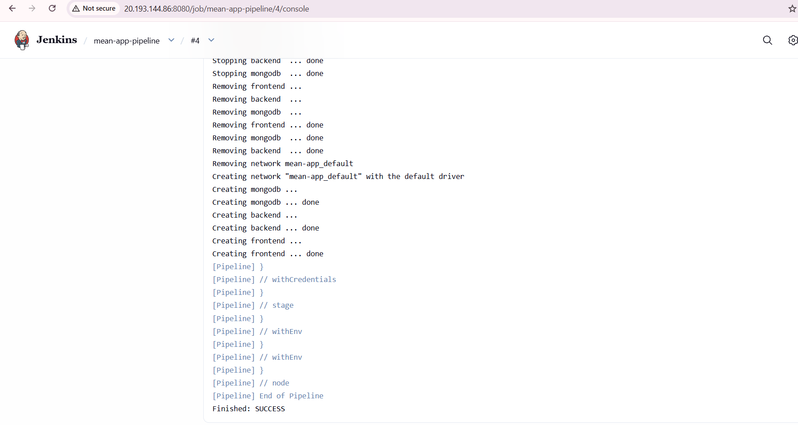
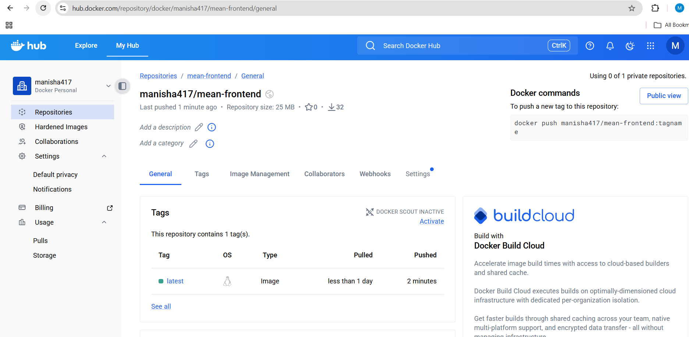
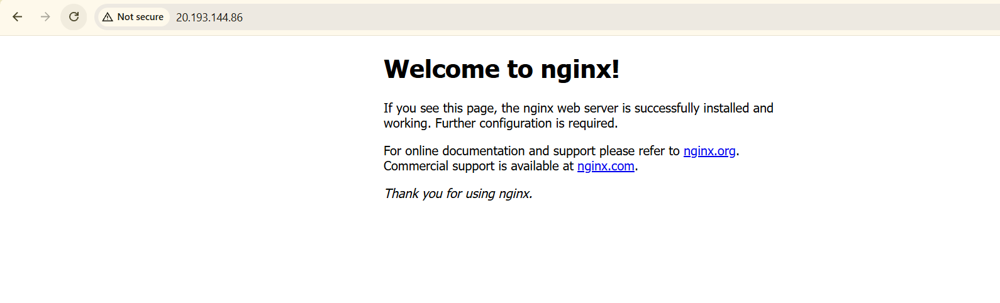
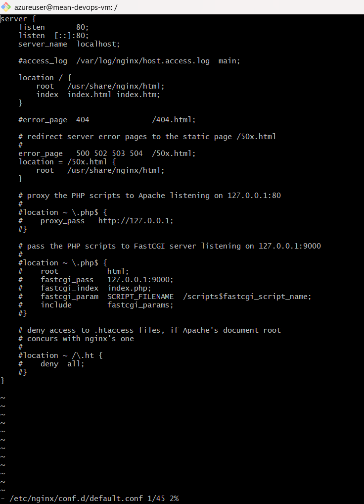

# 🚀 MEAN Stack CI/CD Deployment using Jenkins, Docker & Azure

---

## 📖 Project Overview

This project demonstrates a complete CI/CD pipeline for deploying a MEAN (MongoDB, Express, Angular, Node.js) application using modern DevOps practices.

### 🔧 Technologies Used

- CI/CD automation using **Jenkins**
- Containerization using **Docker**
- Image registry using **Docker Hub**
- Cloud deployment on **Microsoft Azure Virtual Machine**
- Reverse proxy configuration using **Nginx**

The pipeline automatically builds Docker images, pushes them to Docker Hub, and deploys the updated application to an Azure VM.

---

## 🏗️ Architecture
Developer → GitHub Push → Jenkins Pipeline →
Build Docker Images → Push to Docker Hub →
Azure VM pulls latest images → Docker Compose deploys containers →
Nginx Reverse Proxy → Application accessible via Port 80

---

## ⚙️ Prerequisites

- Azure Virtual Machine (Ubuntu 22.04)
- Docker & Docker Compose installed
- Jenkins installed and configured
- Docker Hub account
- GitHub repository containing MEAN application source code

---

# 🚀 Step-by-Step Setup & Deployment

---

## 1️⃣ Azure VM Setup

- Created Ubuntu Virtual Machine on Microsoft Azure
- Installed Docker and Docker Compose
- Opened required ports:
  - 22 (SSH)
  - 80 (HTTP)
  - 8080 (Jenkins)

---

## 2️⃣ Jenkins Installation & Configuration

- Installed Jenkins on Azure VM
- Installed required plugins:
  - Git
  - Pipeline
  - Docker Pipeline
  - Credentials Binding
- Configured Docker Hub credentials securely
- Created Pipeline job to automate:
  - Source code checkout
  - Docker image build
  - Image push to Docker Hub
  - Deployment on Azure VM

---

## 3️⃣ Dockerization

The application was containerized using Docker:

- Backend container (Node.js + Express)
- Frontend container (Angular served via Nginx)
- MongoDB container

Docker Compose was used to orchestrate all services.

---

## 4️⃣ CI/CD Workflow

The Jenkins pipeline performs:

1. Pull latest code from GitHub  
2. Build frontend and backend Docker images  
3. Push images to Docker Hub  
4. Pull latest images on Azure VM  
5. Restart containers automatically  

This ensures automated deployment with zero manual effort.

---

## 5️⃣ Nginx Reverse Proxy

Nginx was configured on the Azure VM as a reverse proxy.

It routes incoming traffic from port 80 to the frontend container.

### 🌐 Application Access URL
http://20.193.144.86/

📸 Screenshots
## 📸 CI/CD Pipeline Execution

## 🐳 Docker Image Build & Push

## 🚀 Application Deployment

## 🌐 Working Application UI

## 🔁 Nginx Configuration

---

# 🎯 Output

✔ Automatic build triggered on GitHub push  
✔ Docker images successfully pushed to Docker Hub  
✔ Containers deployed on Azure VM  
✔ Application accessible via port 80  
✔ Reverse proxy successfully configured  

---

# 📌 Conclusion

This project demonstrates a complete end-to-end DevOps workflow including:

- CI/CD automation  
- Containerized deployment  
- Cloud infrastructure setup  
- Reverse proxy configuration  
- Production-style deployment strategy  

It will look 10x better instantly.

If still not good, send screenshot — I’ll fix layout like a senior DevOps engineer would 💪🔥
